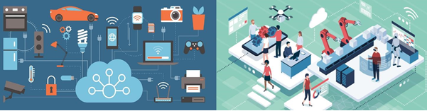
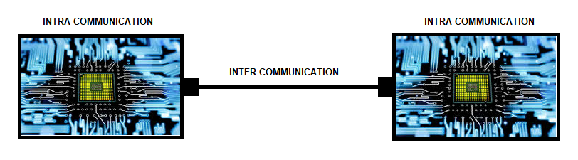
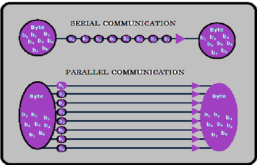

In present times, it is hard to imagine any industry without embedded architecture involvement. But while talking about communication, we typically hear terms like protocol, driver, stack etc. that we are not generally aware. Well, let me dramatize and explain those concepts to understand device communication.

Devices need to communicate with themselves to respond with external devices to operate or to share the data. Communication between devices can be viewed as transferring data in the form of voltage through a physical medium. When the transfer occurs within the device, we call it __Intra communication__ (From processor to I/O’s in a microcontroller). If the transfer is between two separate devices, it is known as __Inter communication__ (From one microcontroller to another). For the data to reach the processor, both Inter and Intra communication happens.

Transfer of data is classified into two types Serial and Parallel communication,

__Serial Communication:__ In serial communication, messages are transferred bit by bit per a clock cycle serially. SPI, I2C, CAN, USB, Ethernet, Ethernet/IP, Profinet, Profibus, EtherCAT, J1939, Modbus, etc., protocols follow Serial Communication for effective data transfer.

In this type of communication, the data synchronization is easy, and data is transferred without any loss.

__Parallel Communication:__ In parallel communication, messages are transferred as 1 byte per single clock pulse, which means 1 byte is split into 8 bits and transmitted through separate data lines. ISA, ATA, SCSI, PCI protocols follow Parallel communication for quick data transfer.

In this type of communication, the data synchronization errors are found more frequently; Crosstalk is observed due to data transfer from multiple cables, i.e., due to electromagnetic flux created in the wires that result in the manipulated data.

This serial and parallel communication is just related to the physical medium to transfer the data.

__Protocol:__ A Protocol is a set of instructions that need to be followed to make an action. To set up a communication and to transfer data, we need communication protocols.
The presence of a protocol in a device is in the form of soft code. All the physical mediums are not similar for all the protocols. Even though the intention is to transmit the data, they are developed uniquely depending on the usage area.
There are multiple numbers of standardized protocols widely used in the industries, and every device will have a communication interface integrated with a protocol. The devices can be able to communicate with each other if they have the same protocol. Communication protocols can be understood with the help of below-mentioned reference models.

We have two standardized reference models accepted universally they are:

-  Open System Interconnection (OSI)
-  Transmission Control Protocol / Internet Protocol (TCP/IP)

After my analogy, I strongly believe that discussing the communication protocols without involving OSI & TCP/IP is technically injustice. Even though all the communication protocols are getting into usage concerning the TCP/IP model, it is better to discuss by referring to the OSI model because it covers all the details in encapsulation and Decapsulation.

__OSI & TCP/IP Model:__

|   OSI (7 layers)   | TCP/IP (4 Layer)  |
| :----------------: | :---------------: |
| Application Layer  | Application Layer |
| Presentation Layer |
|   Session Layer    |
|  Transport Layer   |  Transport Layer  |
|   Network Layer    |  Internet Layer   |
|   Datalink Layer   |
|   Physical Layer   |  Physical Layer   |

__Activities happen in each Layer:__

|In the Application layer -> It generates the data, which must be transmitted.|
|In the Presentation layer -> It gives the data format to the data and encrypts the data.|
|In Session Layer -> It is responsible for starting, maintenance, and termination of the session.|
|In Transport Layer -> It adds what type of transport protocol they are using, i.e., TCP or UDP.|
|In-Network layer -> It adds the sender and receives an IP address.|
|In Datalink Layer -> It adds the sender and receiver MAC or LLC address.|
|In Physical Layer -> It cares about the physical connection between devices and the need to convert received signal to binary form.|

Depending on protocol rules data gets transferred from sender to receiver. Data packets encapsulation is done from the sender end, and the receiver decapsulates the received packet. All layers will not be covered in all the protocols, but they cover necessaries according to the protocol.

__Driver:__ Drivers helps the processor to understand the port. Without having the port drivers, the device cannot access the port.  

__Stack:__ Every Device needs a protocol to communicate with external devices through a physical medium. Usually, devices come with some basic protocols. If we need to communicate with a device that has a different protocol, we need stack. It makes the device to understand the other protocol and establish communication.  

It is a soft code that defines a particular protocol instruction. The existence of the stack is different from the driver in a device. Depending on the application, the stack and driver are involved on the device, but the primary agenda is to implement communication protocol. A stack is executed when it is triggered, but the driver executes whenever the device boots. 
